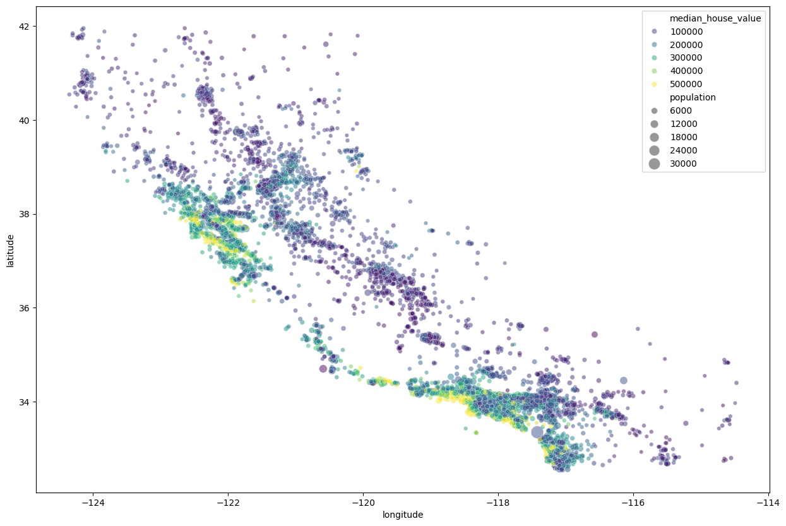

# California Housing Price Prediction
This project builds a machine learning model to predict housing prices in California using the California Housing dataset.

## Overview
The goal is to explore the dataset, preprocess the data, and train regression models to estimate housing prices based on features such as income, location, and population.

## Methods
The project includes:

- Data exploration and visualization
- Data preprocessing
- Train/test split
- Regression model training
- Model evaluation

## Visualization

